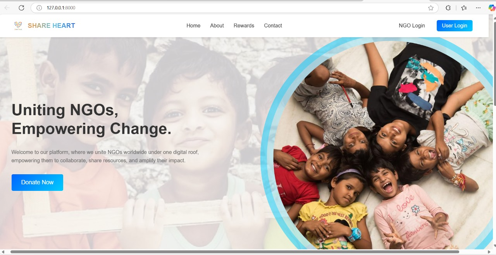
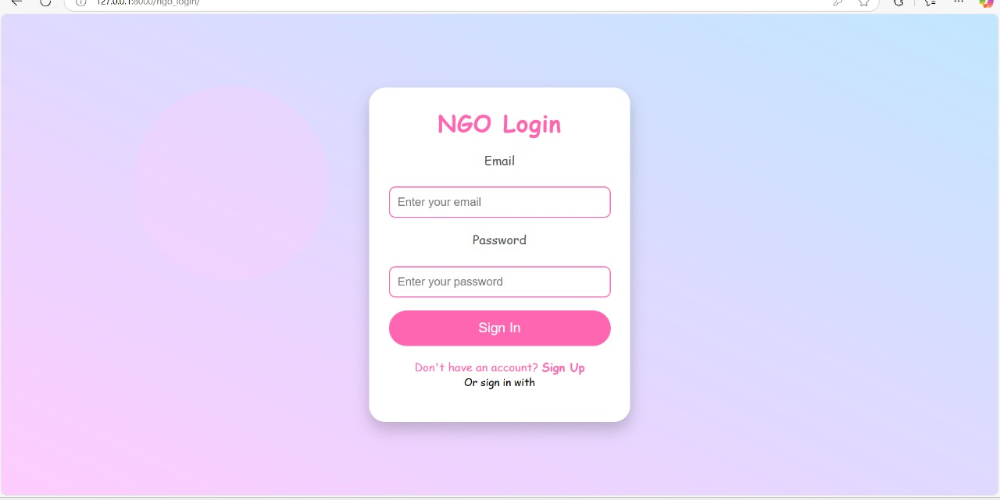
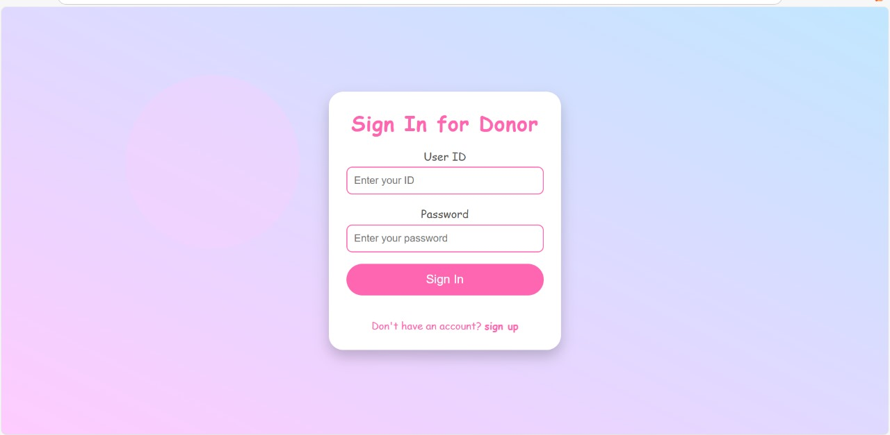
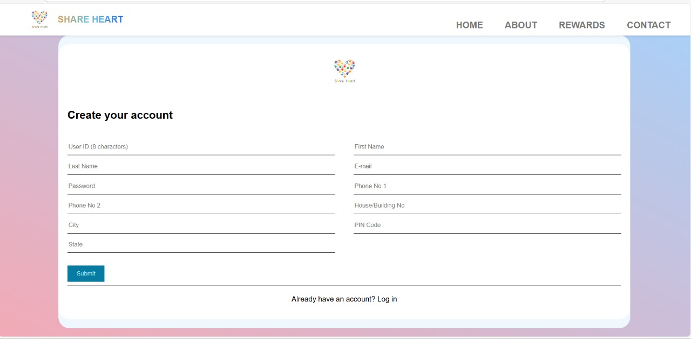
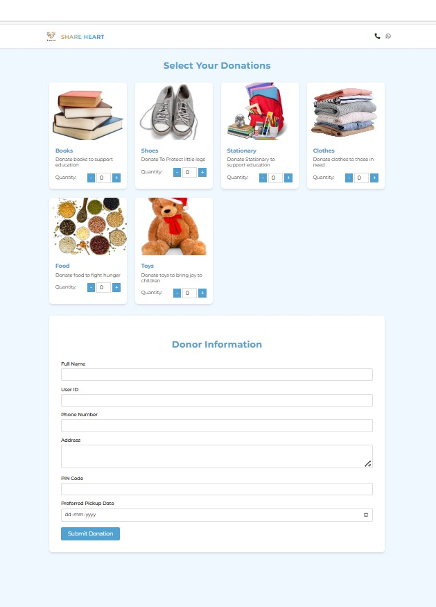

<p align="center">
  
  <strong>ShareHeart Donation Website</strong>
</p>


A platform to connect donors with NGOs and facilitate donations seamlessly.

  <!-- Replace with actual banner image -->

---

## 📌 Features
- ✅ **User & NGO Authentication** – Secure login system with role-based access.
- 🎁 **Donation System** – Users can donate money, clothes, food, etc.
- 🚛 **Scheduled Pickup** – Donors can schedule pickups for physical donations.
- 📊 **Admin Dashboard** – NGOs can manage donations and users.
- 🎨 **Modern UI** – A clean and user-friendly interface.

---

## 🛠️ Tech Stack
- **Frontend:** HTML, CSS, JavaScript  
- **Backend:** Python (Django)  
- **Database:** MySQL / PostgreSQL  
- **Authentication:** Django authentication system    

---

## 📷 Screenshots  
### 🔹 Home Page  
  

### 🔹 Login & Registration  
  
  
  
  

### 🔹 Donation Form  
  

---

## 🚀 Installation & Setup  

### 1️⃣ Clone the Repository  
```sh
git clone https://github.com/yourusername/shareheart.git
cd shareheart
2️⃣ Install Dependencies

pip install -r requirements.txt

3️⃣ Run Migrations

python manage.py makemigrations
python manage.py migrate

4️⃣ Start the Server
Copy
Edit
python manage.py runserver
Visit http://127.0.0.1:8000/ in your browser.

📂 Project Structure

/shareheart
├── images/            # Folder for storing screenshots
│     ├── homepage.jpg
│     ├── login.jpg
│     ├── register.jpg
│     ├── donation-form.jpg
├── templates/        # HTML templates
├── static/           # CSS, JavaScript, Images
├── donations/        # Main donation app
├── users/            # User authentication system
├── media/            # Uploaded images/files
├── db.sqlite3         # Database (if using SQLite)
├── manage.py          # Django management script
└── README.md          # This file
vbnet
Copy
Edit


